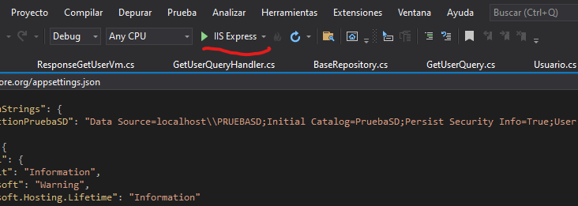
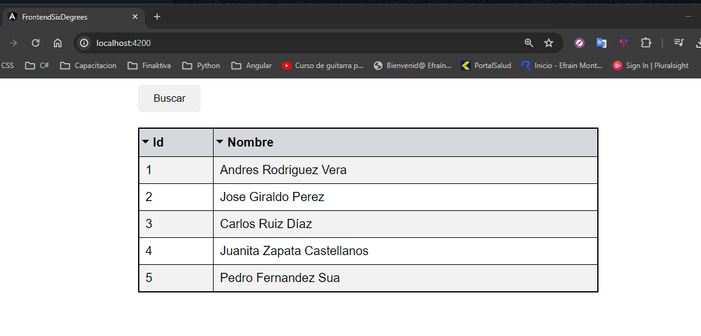

# prueba-tecnica-sixdegrees
Prueba Tecnica de Ingreso

## Como empezar
Estas son las instrucciones para clonar y ejecutar los proyectos localmente.

### Prerrequisitos

Para el proyecto BackendSixDegrees tener instalado lo siguiente:
- Visual Studio 2019
- .Net 5.0
- SQL Server

Para el proyecto FrontendSixDegrees tener instalado lo siguiente:
- Angular CLI: 16.0.0
- Node.js: 18.12.0
- Npm: 10.4.0

### Instalación
1. Clona el repositorio: `git clone https://github.com/EfraMonR/prueba-tecnica-sixdegrees.git`
2. Abre el archivo Script-DBPruebaSD.sql y ejecutado en SQL (Esto creara la base de datos, tabla y registros).

### Configuración proyecto BackendSixDegrees
1. Ejectua el archivo BackendSixDegrees.sln con Visual Studio 2019

2. Verifica configuración de base de datos el archivo appsettings.json ubicado: 

3. Modifica configuración segun entorno local e instancia:

4. Ejecuta el proyecto:

5. Se abre de manera automatica el navegador ejecutando swagger:

6. Dejar abierto el navegador.

### Configuración proyecto FrontendSixDegrees
1. Abre el proyecto con Visual Studio Code.

2. Abrir terminal de VS Code.

3. Ejecutar el comando `npm install` para actualizar dependencias:

4. Ejecutar el comando `ng serve` para iniciar el proyecto

5. Iniciar el navegador de preferencia y escribir en la url `http://localhost:4200/` :

6. Clickear el boton Buscar y de esta forma cargaran los datos del api ejecutada desde el proyecto de .net:

### IMPORTANTE
Ambos proyectos deben estar en ejecución de manera simultanea para su funcionamiento.